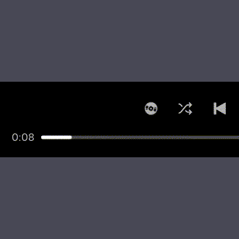

# Better Rewind

Hold the vinyl button to rewind through a track like you're doing a boiler room set. Release to stop and resume playback from wherever you landed.

Based on [Reeeeewwwwinnnddd](https://github.com/NickColley/spicetify-rewind) by [Nick Colley](https://github.com/NickColley).

## How it works

- **Hold** the vinyl button to rewind at 5x speed
- **Hold + Shift** to rewind at 20x speed
- **Release** to stop rewinding and resume playback from that position
- Vinyl scratch SFX plays while held with a scratch-out on release
- SFX volume syncs with Spotify's volume slider in real-time
- Automatically stops when it reaches the start of the track
- Works with mouse and touch input

## How to install

### 1. Using the Spicetify Marketplace (recommended)
1. Search `Better Rewind` under the "Extensions" tab
2. Click the Install button
3. All done!

### 2. Manual installation
1. Make sure you have [Spicetify](https://spicetify.app) installed
2. Download the [index.js](./index.js) file
3. Put the file inside the Spicetify Extensions directory. Find the correct directory here: [https://spicetify.app/docs/development/extensions](https://spicetify.app/docs/development/extensions)
4. Then, run ```spicetify config extensions index.js```
5. Then apply Spicetify by running ```spicetify apply```
6. All done!

If you enjoy this extension consider giving it a star so other people can find it easier in the marketplace :)

[](https://github.com/VLTNOgithub/spicetify-better-rewind/)


